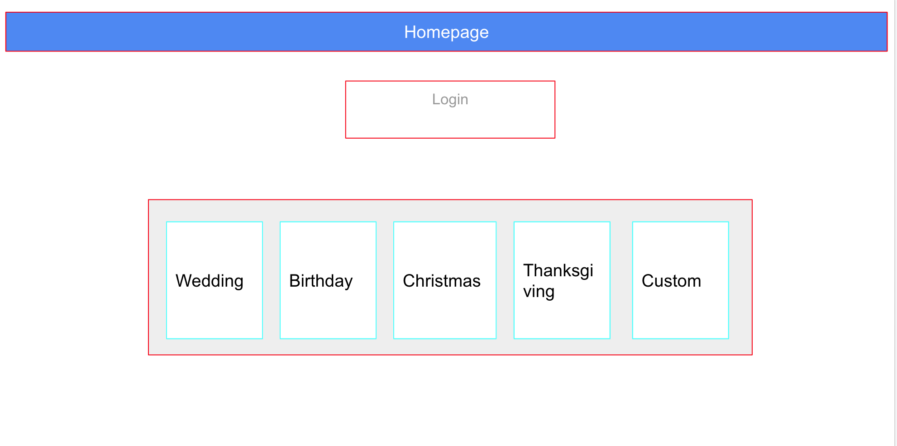
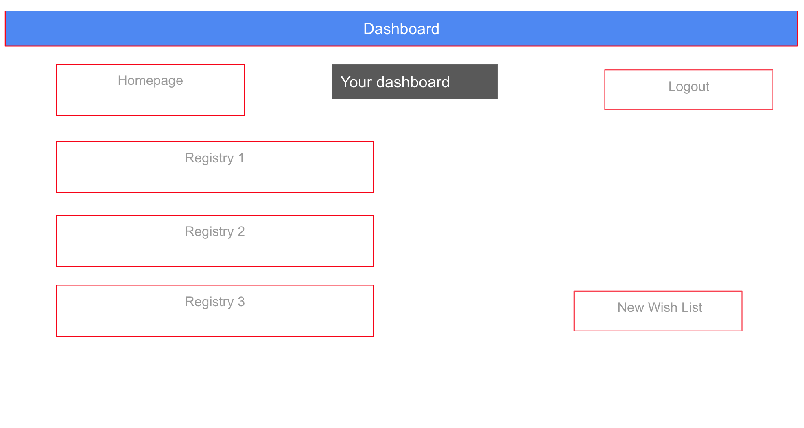
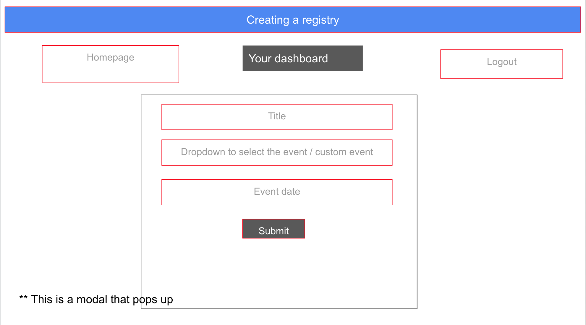
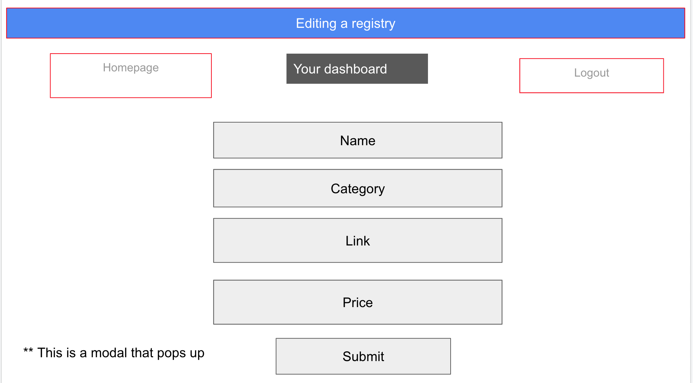
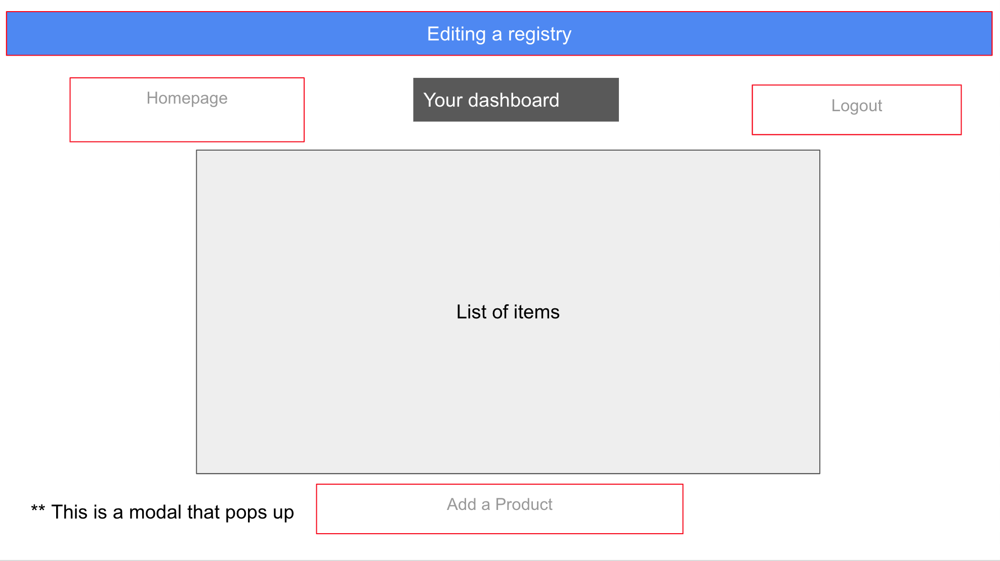

# wish-list
 A place to create wish-lists and registries, add and delete items


## Table Of Contents
* [Description](#description)
* [Wireframe](#wireframe)
* [Installation](#installation)
* [Usage](#usage)
* [Technologies](#technologies)
* [License](#license)
* [Author Links](#author-links)

## Description
This is a full stack application that implements a wish list or a gift registry for an event. Through an easy to use interface, a user can register with the app, create any number of registries. The user can manage the registries they own by adding, updating or removing products. The registries are also visible to any visitor to the page or a guest to an event to look up items to fulfill.

- The deployed app is at: https://wish-list-maker.herokuapp.com/
- The github repo is: https://github.com/AJManzione/wish-list

## Wireframe

1. Homepage


2. Sign up


3. Dashboard


4. Create a new registry


5. Add a new product / item to the registry


6. List of products / items in the registry


## Code Snippets
### API Routes
| Resource | URL | HTTP Verb | Userd For |
| ----------- | ----------- | ----------- | ----------- |
| USER | /api/user/login | GET | API route for logging in a user |
| ----------- | ----------- | ----------- | ----------- |
| USER | /api/user/logout | POST | API route for logging out a user |
| ----------- | ----------- | ----------- | ----------- |
| USER | /api/user/signup | POST | APi route for creating a new user |
| ----------- | ----------- | ----------- | ----------- |
| USER REGISTRY | /api/registry | POST | Creating a new registry belonging to a specific user |
| ----------- | ----------- | ----------- | ----------- |
| USER REGISTRY | /api/registry/:id | PUT | Edit a registry by id |
| ----------- | ----------- | ----------- | ----------- |
| USER REGISTRY | /api/registry/:id | DELETE | Delete a registry given the id |
| ----------- | ----------- | ----------- | ----------- |
| PRODUCT | /api/product | POST | Creating a new product (category id, registry id, user_id) |
| ----------- | ----------- | ----------- | ----------- |
| PRODUCT | api/product/:id | PUT | For changing the price, name, link, category_id, other details |
| ----------- | ----------- | ----------- | ----------- |
| PRODUCT | api/product/:id | DELETE | For deleting one product by id |
| ----------- | ----------- | ----------- | ----------- |
| CATEGORIES | /api/category | GET | Get all categories to then use for drop down |
| ----------- | ----------- | ----------- | ----------- |

### Model Associations

```
User.hasMany(Registry, {
  foreignKey: "user_id",
  onDelete: "cascade",
});

Registry.belongsTo(User, {
  foreignKey: "user_id",
  onDelete: "cascade",
});

Category.hasMany(Product, {
  foreignKey: "category_id",
});

Product.belongsTo(Category, {
  foreignKey: "category_id",
});

Product.belongsTo(Registry, {
  foreignKey: "registry_id",
  onDelete: "cascade",
});

Registry.hasMany(Product, {
  foreignKey: "registry_id",
  onDelete: "cascade",
});

User.hasMany(Product, {
  foreignKey: "user_id",
  onDelete: "cascade",
});

Product.belongsTo(User, {
  foreignKey: "user_id",
  onDelete: "cascade",
});
```

### HTML Routes
| Resource | URL | HTTP Verb | Userd For |
| ----------- | ----------- | ----------- | ----------- |
| USER CREATE | /login | GET | Returns an HTML page either  create a new user OR signing in a user |
| ----------- | ----------- | ----------- | ----------- |
| REGISTRY | /registry | GET | Gets all registries belonging to a single user |
| ----------- | ----------- | ----------- | ----------- |
| SINGLE REGISTRY | registry/:id | GET | Get a single registry |
| ----------- | ----------- | ----------- | ----------- |
| EDIT REGISTRY BY ID | /dashboard/edit/:id | GET | Get page to edit a single registry by id |
| ----------- | ----------- | ----------- | ----------- |
| HOMEPAGE | / | GET | Gets all registries. Username, First_name, date_created |
| ----------- | ----------- | ----------- | ----------- |
| LANDING | /* | GET | 404 catch all |
| ----------- | ----------- | ----------- | ----------- |
| DASHBOARD | /dashboard | GET | Gets all registries for that current user_id |
| ----------- | ----------- | ----------- | ----------- |

## Installation
The application has been deployed to [Heroku](https://wish-list-maker.herokuapp.com/).  

The application can also be used for test purposes by starting the server from the command line along with a browser client (homepage at http://localhost:3001/).

1. Set up the environment variables in the .env file (the DB_PASSWORD variable should be set to the user's SQL password)
```
DB_NAME=wish_list_db
DB_USERNAME=root
DB_PW=<your password>
```

2. Set up the 'wish_list_db' database using the following commands: 

Start in the project directory:

``` 
$ mysql -u root
mysql> source db/schema.sql 
^C (to quit the mysql shell)
```

3. Seed the database

The database is initialized using the following (start in the project directory):

```
$ node seeds/seed.js
```

4. Install packages using npm

Return to the project directory from the db directory, and install packages:

```
$ cd ..
$ npm i
```

## Usage

Start the application from the command line with the following command in the project directory:

```
$ node server.js
```
From the browser navigate to http://localhost:3001 to use the frontend website.

## Technologies
- HTML / CSS
- Bootstrap
- Javascript
- express.js framework
- Sequelize 
- Handlebars.js
- Express-session
- bcrypt
- Granim.js library

## References
- [Sequelize](https://sequelize.org/docs/v6/core-concepts/model-basics/)
- [Handlebars.js](https://handlebarsjs.com/)
- [Express Session](https://www.npmjs.com/package/express-session)
- [bcrypt.js](https://www.npmjs.com/package/bcrypt)
- [Granim.js](https://sarcadass.github.io/granim.js/index.html)

## License
This application is covered under the [MIT License](https://opensource.org/licenses/MIT).

## Author Links
[GitHub] [Anthony]() [Jie](https://github.com/Zoujiejie) [William]() [Priya](https://github.com/sbhikshe)\
[LinkedIn] [Anthony]() [Jie](https://www.linkedin.com/in/jie-zou-2779ab161/) [William]() [Priya](https://www.linkedin.com/in/sripriya-bhikshesvaran-8520992/)


